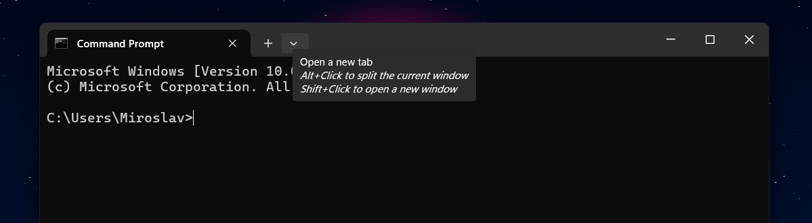

# 🥳 Поздравляю, теперь при перезагрузке бота у нас не теряются состояния пользователей!

### Но теперь, чтобы ты смог запустить бота, нужно немного поднапрячься... 😢

Для начала тебе нужно установить WSL (если не получится по моему мини-гайду, то поищи в интернете). Делается это просто:
1) Заходишь в PowerShell от имени администратора.
2) Прописываешь туда: `wsl --install -d Ubuntu`.
3) Если всё установилось без проблем, перезагружаешь комп.
4) Теперь ты можешь юзать терминал Linux. Чтоб это сделать, заходишь в cmd и нажимаешь эту кнопку: 

Из выпадающего списка выбираешь Ubuntu. Тебя попросят указать имя пользователя и пароль - их ты придумываешь (пароль запомни!).

5) Обновляем систему и устанавливаем нужную утилиту:

`sudo apt update && sudo apt dist-upgrade`

`sudo apt install redis`

6) Перезапуск сервера: `sudo service redis-server restart`
Статус сервера (должны сказать, что всё гуд): `sudo service redis-server status`

7) Теперь можно переходить к боту. В файлике requirements.txt добавилась новая библиотека (redis), ты должен её установить.

### После данных махинаций можешь как обычно запускать бота и проверять.

###### Возможно, это выглядит сложно, но по факту делается это за 5 минут.
